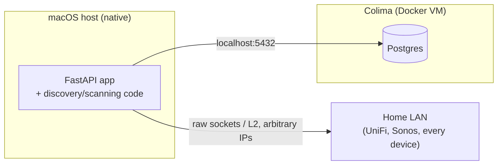
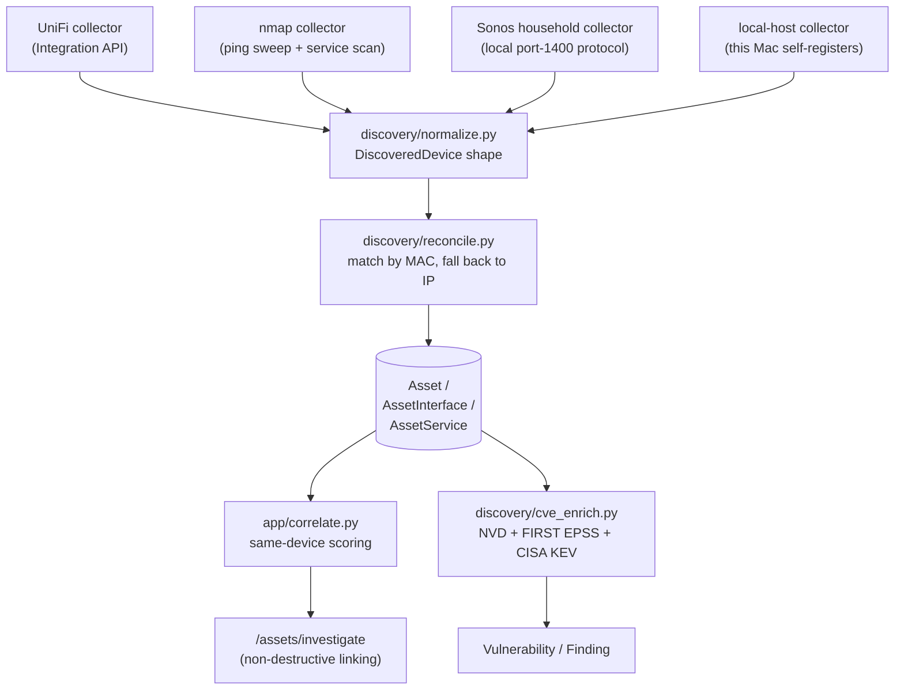
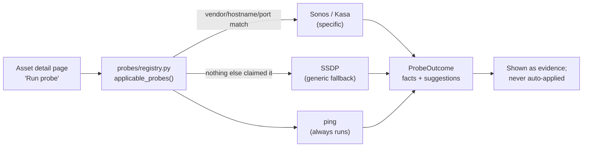

# Architecture Deep-Dive

This expands on the README's [Architecture](https://github.com/rohitafish/home-asset-manager#architecture)
section — the *why* behind the shape of the system, not just the *what*.

## The native-vs-container split

Three moving parts, two different homes, and the split is forced by one
question: **does it need real access to the LAN?**

- **The FastAPI app and every discovery/scanning module run natively** in a
  Python venv on the Mac — not in a container. `nmap` needs raw-socket/L2
  access to the LAN, and on macOS *every* Docker runtime (Colima, Docker
  Desktop) puts containers behind a Linux VM's virtualised networking, which
  can't reliably provide that.
- **Postgres runs in Docker**, via [Colima](https://github.com/abiosoft/colima)
  (a lightweight, GUI-free Docker runtime). It only ever needs a `localhost`
  TCP port, never the LAN — so the VM boundary costs it nothing, and
  containerising it avoids a native Postgres install to maintain.

## The discovery pipeline

Every collector converges on the same shape (`DiscoveredDevice`, in
`discovery/normalize.py`) before reconciliation, so `discovery/reconcile.py`
only has to reason about one input format regardless of source. All four
collectors are **synchronous, on-demand, and never raise** — a failed or
unreachable source reports its failure in the run summary rather than
crashing the discovery run.

**The four collectors:**

| Collector | Source | Finds |
|---|---|---|
| UniFi (`discovery/unifi_client.py`) | The UniFi Integration API (local controller or UDM/Cloud Gateway) | Clients + UniFi-managed devices, with UniFi's own naming |
| nmap (`discovery/nmap_scan.py`) | A two-phase `-sn` ping sweep + `-sV` service scan against `SCAN_SUBNETS` | Anything on the LAN, MAC via ARP, open ports/service banners |
| Sonos household (`discovery/sonos_household.py`) | One `GetZoneGroupState` call to any known Sonos player | Every player in the household, room names, stereo-pair/satellite topology |
| local-host (`discovery/local_host.py`) | The Mac this app runs on | Self-registers the host running the app |

Full details on each: [Discovery Collectors Guide](Discovery-Collectors-Guide).

### Keeping repeated runs from degrading data quality

A few explicit rules stop discovery from clobbering good data on a later run:

- **Hostname source priority** — UniFi-sourced names outrank nmap's raw
  reverse-DNS/mDNS names (which can be things like `EPSONF8467B.localdomain`).
  `hostname_source` tracks which collector last set it.
- **Hostname locking** — any asset's hostname can be manually locked; a locked
  hostname is never touched by discovery, regardless of source priority.
- **VLAN/network annotation** — both UniFi and nmap paths resolve each
  device's VLAN/network from UniFi's `/networks` endpoint, so this is
  populated consistently no matter which collector found the device.
- **Lifecycle-gated reclassification** — `asset_type` only auto-updates while
  an asset is still `discovered`; once triaged to `active`, its type is frozen.
- **Per-VLAN gateway addresses attach to the router**, not new phantom assets
  — see the README for the exact matching logic.

## Probes: on-demand investigation, not collection

Probes (`probes/`) are a deliberately separate concept from collectors. A
collector runs a sweep and reconciles many devices at once; a **probe** is
triggered per-asset from the UI to ask *that one device* a direct question
via its own local API — a Sonos zone name, a Kasa plug's user-set alias, a
generic UPnP device description.

**Hard rule, enforced by convention across every probe module: read-only.**
No probe ever sends a command that changes device state. Everything a probe
returns is a *suggestion* — for a human, or the AI assistant under its own
propose-and-approve rules (see [Security Model](Security-Model)) — to act on
by editing the asset. Probes never write to `Asset`/`AssetInterface`/
`AssetService` themselves.

Adding a new probe is intentionally low-ceremony: write a module exposing a
`PROBE` instance with `applies_to()` (a cheap, no-network check) and `run()`
(the actual read-only call, which must never raise), then register it in
`probes/registry.py`. Nothing else needs to change.

## Duplicate detection: two different tools on purpose

There are two distinct mechanisms for "these might be the same device," and
they're kept separate deliberately:

- **`app/correlate.py` — scoring + non-destructive linking.** Scores pairs of
  assets that might be one physical device (e.g. a laptop's wired and
  wireless NICs showing up as two rows) and links them via a `CIRelationship`
  row on `/assets/investigate`. Both rows and both histories are kept — right
  when a device legitimately has two distinct identities worth tracking
  separately.
- **`app/asset_merge.py` — the destructive Duplicates page.** Collapses two
  asset rows into one and deletes the loser — right when discovery genuinely
  created two rows for what should have been a single asset.

## Vulnerability enrichment

`discovery/cve_enrich.py` matches nmap-detected service versions against the
live **NVD CVE API** (keyword search — not authoritative CPE matching; see
[CVE Matching & Valuation Methodology](CVE-Matching-and-Valuation-Methodology)),
then layers on **FIRST EPSS** exploit-likelihood scores and the
**CISA KEV** (Known Exploited Vulnerabilities) catalogue. Enrichment only runs
against services where nmap reported *both* a product name and a version — a
bare product name alone produced confirmed false positives during
development.

## The AI assistant

A per-asset chat panel, backed by Claude (directly via Anthropic, or via
OpenRouter as a configured fallback — see
[Configuration Reference](Configuration-Reference)), that can answer
questions, read an attached document, and propose field changes. It's
entirely optional (inert with no API key configured) and its safety model —
propose-and-approve, read-only/propose-only tools, untrusted-data wrapping —
is covered in depth in [The LLM Assistant, Explained](The-LLM-Assistant-Explained)
and [Security Model](Security-Model).

## Data model, at a glance

| Table | Holds |
|---|---|
| `Asset` | The core inventory row — vendor, model, serial, purchase/warranty, owner, criticality, lifecycle status |
| `Location` | Rooms/areas an asset can be assigned to |
| `AssetInterface` | Per-NIC data — MAC, IP, VLAN/network, connection type |
| `AssetService` | Open ports/services discovered on an asset |
| `CIRelationship` | Non-destructive same-device links from `correlate.py` |
| `AssetNote` | Free-text/automated provenance notes (incl. AI-assistant actions) |
| `ProbeResult` | Evidence from a probe run (facts, raw response, suggestions) |
| `ChatMessage` | The assistant chat transcript, per asset |
| `ChangeProposal` | A pending AI-suggested change, awaiting human approval |
| `DiscoveryRun` | A record of one discovery run and its summary |
| `Vulnerability` / `Finding` | Enriched CVE data and its match to a specific asset/service |

## Entry points

- **Web app** — `uvicorn app.main:app`, routed through `app/routers/assets.py`
  (JSON-ish API surface) and `app/routers/dashboard.py` (the HTML dashboard).
- **CLI** (`discovery/cli.py`, Typer) — `unifi`, `nmap`, `local-mac`,
  `account-import`, `sonos`, `enrich`, `revalue`, and `all` (every discovery
  source in one pass). Full flag reference in the README's
  [CLI reference](https://github.com/rohitafish/home-asset-manager#cli-reference).
