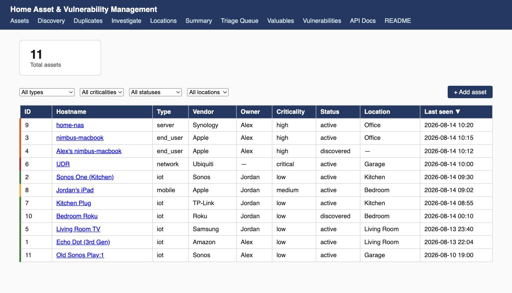

# Home Asset & Vulnerability Management

A self-hosted, CMDB-style asset inventory and lightweight vulnerability
management tool — scaled down from enterprise asset/vulnerability management
practice to fit a home network of tens of devices, not thousands.

*Screenshot from fabricated demo data — no real household inventory appears in this wiki.*

It discovers what's actually on your network (via UniFi, nmap, and Sonos),
keeps a proper asset register (vendor, model, serial, purchase price,
warranty, owner, location), does best-effort CVE matching against detected
services, and estimates insurance replacement values — all running locally on
your own LAN, with nothing exposed to the internet.

## At a glance

| | |
|---|---|
| **Runs on** | macOS (native host process — see [Architecture Deep-Dive](Architecture-Deep-Dive)) |
| **Needs** | A Ubiquiti UniFi network (self-hosted controller or UDM/Cloud Gateway) |
| **Network exposure** | LAN-only. No port forwarded, ever. |
| **Discovery** | On-demand only — nothing scans continuously in the background |
| **Data leaves your network** | Only if you configure the optional AI assistant, and only per-conversation — see [Security Model](Security-Model) |

## Who this is for

You're inventorying a home network in the tens-of-devices range, you already
run (or are willing to run) a UniFi network, you're comfortable running a
native macOS service, and you want a real asset register — not a spreadsheet —
with some automation on top. If any of those don't hold (Windows/Linux only,
hundreds of devices, no UniFi), this probably isn't the right tool; see
[Roadmap / Known Limitations](Roadmap-and-Known-Limitations).

## Where to go next

| I want to... | Go to |
|---|---|
| Install it | The [README](https://github.com/rohitafish/home-asset-manager#one-time-setup) — full setup, CLI reference, and usage guide |
| Understand how it's built | [Architecture Deep-Dive](Architecture-Deep-Dive) |
| Know what it does with my data before I trust it on my LAN | [Security Model](Security-Model) |
| See what each `.env` setting does | [Configuration Reference](Configuration-Reference) |
| Understand a specific discovery collector | [Discovery Collectors Guide](Discovery-Collectors-Guide) |
| Understand a specific probe | [Probes Reference](Probes-Reference) |
| Understand the AI assistant's safety model | [The LLM Assistant, Explained](The-LLM-Assistant-Explained) |
| Know how vulnerability matching and valuations actually work (and their limits) | [CVE Matching & Valuation Methodology](CVE-Matching-and-Valuation-Methodology) |
| Fix something that's not working | [Troubleshooting / FAQ](Troubleshooting-FAQ) |
| See what's deliberately out of scope | [Roadmap / Known Limitations](Roadmap-and-Known-Limitations) |
| Contribute | [Contributing](Contributing) |

## Project links

- [Source & README](https://github.com/rohitafish/home-asset-manager)
- [Report a security issue](https://github.com/rohitafish/home-asset-manager/security/policy) — please don't open a public issue for one
- [Licence (MIT)](https://github.com/rohitafish/home-asset-manager/blob/main/LICENSE)
- [Open issues](https://github.com/rohitafish/home-asset-manager/issues)
